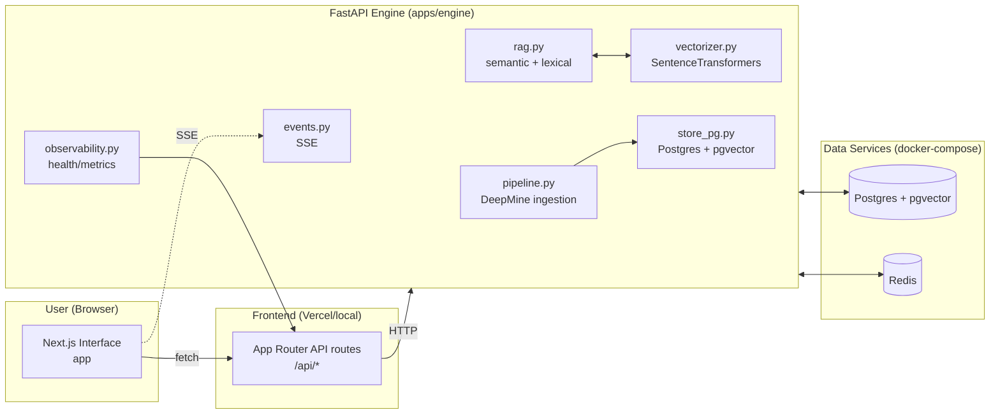
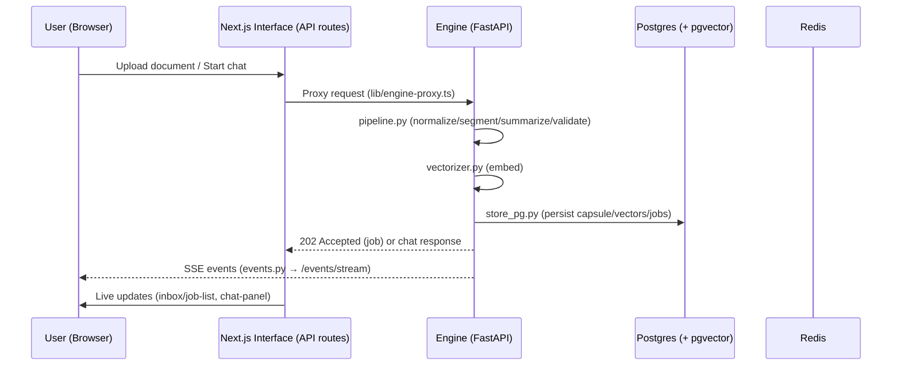

# N1Hub v0.1 Architecture

> **Scope.** This document describes the production architecture of the `num1hub/n1hub.com` monorepo exactly as implemented in the repository snapshot that contains `apps/engine/**`, `app/**`, `components/**`, `infra/sql/**`, `infra/docker-compose.yml`, `scripts/**`, and `docs/**`. All file and module names referenced below exist in this tree.

---

## A. Executive Summary

**N1Hub.com** is an AI‑native knowledge system implemented as a Node workspaces monorepo with a Python FastAPI backend and a Next.js App Router frontend. The system ingests “anything,” transforms it into strictly validated **Capsules** via a **DeepMine** pipeline, links capsules into a graph, and serves grounded chat with strict citations using a hybrid **semantic + lexical RAG** engine over PostgreSQL with **pgvector**.  

* **Backend (FastAPI)** — `apps/engine/`: pipeline, validators, link suggestions, vectorizer (SentenceTransformers), RAG, audit logging, SSE events, observability. 
* **Frontend (Next.js interface)** — `app/`: App Router pages (`/capsules`, `/chat`, `/graph`, `/inbox`) and API proxy routes (`/api/capsules`, `/api/chat`, `/api/import`, `/api/jobs`, `/api/events/stream`). 
* **Root Next.js app & shared UI** — `app/` and `components/` provide a root UI (landing/layout) and a shared **shadcn/ui** component library. 
* **Infra** — PostgreSQL + Redis via `infra/docker-compose.yml`, SQL migrations under `infra/sql/0001–0004`. 
* **Scripts & CI** — Dev/migration scripts (`scripts/**`) and CI gates (`.github/workflows/ci.yml`) enforce linting, tests, migrations verification, env validation, and capsule spec alignment.  

---

## B. Core System Principles

1. **Strict capsule contract** — All content is normalized into a four‑part Capsule structure and validated before indexing. 
2. **Deterministic ingestion** — A multi‑stage pipeline applies normalization, segmentation, summarization, validation, indexing, and linking as separate, testable steps.  
3. **Grounded answers with citations** — The RAG engine enforces strict, per‑source citations and scope filters. Tests cover scopes and citation behavior.  
4. **Operational visibility** — Health and observability endpoints exist; audit logs and end‑to‑end tests are part of the repository. 
5. **Monorepo ergonomics** — One workspace with shared UI and scripts; CI validates migrations, environment, and spec alignment before merging. 

---

## C. High‑Level Architecture Diagram



The modules referenced above exist at the indicated paths. 

---

## D. Repository Structure Overview

Key directories and files:

* **Backend (engine)** — `apps/engine/app/`
  `pipeline.py`, `rag.py`, `vectorizer.py`, `store_pg.py`, `events.py`, `retention.py`, `errors/taxonomy.py`, `validators/capsule_validator.py`, `observability.py`, `main.py`, plus `linking/link_suggester.py`, `utils/pii.py`, and config/bootstrap modules. 
* **Frontend (interface)** — `app/`
  Pages: `capsules/page.tsx`, `capsules/[id]/page.tsx`, `chat/page.tsx`, `graph/page.tsx`, `inbox/page.tsx`.
  API routes: `api/capsules/route.ts`, `api/capsules/[id]/route.ts`, `api/chat/route.ts`, `api/import/route.ts`, `api/jobs/route.ts`, `api/jobs/[id]/route.ts`, `api/events/stream/route.ts`.
  Libraries: `lib/api.ts`, `lib/engine-proxy.ts`, `lib/server-client.ts`, `lib/state.ts`, `lib/types.ts`, `lib/utils.ts`.
  Components: e.g., `components/chat-panel.tsx`, `components/rag-scope-toggle.tsx`, `components/job-list.tsx`, `components/upload-form.tsx`. 
* **Root UI & shared kit** — `app/` (layout/page) and `components/ui/*` (shadcn/ui). 
* **Infra** — `infra/docker-compose.yml`, SQL migrations `infra/sql/0001_capsule_store.sql` .. `0004_update_vector_dimension.sql`. 
* **Scripts** — `scripts/dev.sh`, `scripts/dev-win.ps1`, `scripts/migrate.sh`, `scripts/migrate.ps1`, `scripts/verify_migrations.*`, `scripts/validate_env.py`. 
* **CI** — `.github/workflows/ci.yml`. 

A monorepo overview with the same roles is also provided in the repo’s contributing guide. 

---

## E. Backend Architecture (FastAPI Engine)

**Entrypoint & composition.** The engine is a FastAPI application with its entrypoint at `apps/engine/app/main.py`. Core subsystems live as first‑class modules under `apps/engine/app/` and are covered by tests in `apps/engine/tests/`. 

### 1) DeepMine ingestion pipeline

* **Module:** `apps/engine/app/pipeline.py` (pipeline orchestration). 
* **Concept:** A **9‑step** DeepMine pipeline performs deterministic ingestion and transformation from raw input to validated, indexed Capsules. The project README and architecture docs describe this explicitly.  

**Typical stages (as implemented across the engine modules):**

1. **Ingest/bootstrap** — request parsing & initial staging. `bootstrap.py` and `app/bootstrap/*` support seed and startup flows. 
2. **Normalization** — content cleanup & canonical formatting.
3. **Segmentation** — chunking for retrieval granularity.
4. **Summarization / signal extraction** — synthesis of concise summaries and hints.
5. **Validation** — strict Capsule contract checks via `validators/capsule_validator.py` and route support in `routes/validation.py`. 
6. **Vectorization** — embedding generation with `vectorizer.py`. 
7. **Indexing & storage** — persistence in Postgres/pgvector via `store_pg.py`. 
8. **Linking** — relationship discovery using `linking/link_suggester.py`. 
9. **Audit & events** — audit trail persistence (see SQL migration `0003_audit_logs.sql`) and job/event emission via `events.py`. 

**Privacy/PII hygiene.** Utilities in `app/utils/pii.py` support PII scanning and hygiene during pipeline stages. 

### 2) Capsule structure (4‑part contract)

Capsules follow a four‑section contract: **metadata**, **core_payload**, **neuro_concentrate**, and **recursive**. This contract is enforced in the engine’s models/validators and mirrored in documentation and tools. 

* **Models & schema:** `apps/engine/app/models.py` defines the canonical data models stored by `store_pg.py` and created by `pipeline.py`. 
* **Validator:** `apps/engine/app/validators/capsule_validator.py` performs contract validation and autofix where applicable; API exposure via `apps/engine/app/routes/validation.py`. 
* **Spec alignment tool:** `tools/validate_capsule_alignment.py` checks repository alignment to the capsule contract during CI. 

### 3) Validation system

* Strict validation logic lives in `validators/capsule_validator.py` with dedicated tests such as `tests/test_validator.py` and `tests/test_validation_routes.py`. 
* The error taxonomy is centralized in `errors/taxonomy.py` to standardize error categories and messages across the pipeline and API. 

### 4) RAG engine (semantic + lexical)

* **Modules:** `apps/engine/app/rag.py` and `apps/engine/app/vectorizer.py`. 
* **Behavior:** The README describes a **semantic + lexical** retrieval strategy with strict citation requirements; tests (e.g., `tests/test_rag_scopes.py`, `tests/test_strict_citations.py`) cover scope controls and citation behavior.  

**Retrieval targets** are stored in Postgres with pgvector; migration `0004_update_vector_dimension.sql` updates vector dimensionality to match the configured embedding model.  

### 5) Embedding model

The `vectorizer.py` module integrates **SentenceTransformers** to produce dense embeddings for semantic retrieval, as documented in the README. The vector dimension change in `infra/sql/0004_update_vector_dimension.sql` reflects the active embedding model.  

### 6) Database integration (Postgres + pgvector)

* **Persistence:** `apps/engine/app/store_pg.py` encapsulates all Postgres I/O, including vector operations via pgvector. 
* **Schema evolution:** SQL migrations under `infra/sql/` define the Capsule store and related structures:
  `0001_capsule_store.sql`, `0002_validation_and_links.sql`, `0003_audit_logs.sql`, `0004_update_vector_dimension.sql`. 

### 7) Job system

* Ingestion processes are tracked as **jobs** persisted in Postgres and surfaced via API; the interface exposes `/inbox` and `/api/jobs` (proxying to the engine’s job endpoints). Tests such as `tests/test_ingest_job.py` and `tests/test_e2e_workflow.py` validate job lifecycle.  
* UI components like `components/job-list.tsx` and routes `app/api/jobs/*.ts` implement job listing and status polling. 

### 8) Audit logging

* The audit trail is explicitly modeled by the `infra/sql/0003_audit_logs.sql` migration and covered by `apps/engine/tests/test_audit_logging.py`. 

### 9) Observability endpoints

* **Health & docs:** The engine exposes health and documentation endpoints (`/healthz`, `/docs`) as referenced by the README. A dedicated `observability.py` module exists for deeper signals.  
* **Tests:** `apps/engine/tests/test_health.py` exercises health behavior. 

### 10) Events & retention

* **Events (SSE):** `apps/engine/app/events.py` publishes server‑sent events used by the UI for live job updates; the interface proxies `/api/events/stream` to the engine’s SSE endpoint. 
* **Retention:** Policy/cleanup logic is implemented in `apps/engine/app/retention.py`. 

---

## F. Frontend Architecture (app)

The **primary user interface** is the Next.js App Router app in `app/`. It renders the end‑user experience (inbox, capsules, graph, chat) and **proxies** API calls to the engine. 

### 1) App Router routes

* **Pages:**
  `/` → `app/page.tsx`
  `/capsules` → `app/capsules/page.tsx`
  `/capsules/[id]` → `app/capsules/[id]/page.tsx`
  `/chat` → `app/chat/page.tsx`
  `/graph` → `app/graph/page.tsx`
  `/inbox` → `app/inbox/page.tsx` 

* **API routes (proxy layer):**
  `app/api/capsules/route.ts`, `app/api/capsules/[id]/route.ts`
  `app/api/chat/route.ts`
  `app/api/import/route.ts`
  `app/api/jobs/route.ts`, `app/api/jobs/[id]/route.ts`
  `app/api/events/stream/route.ts` 

### 2) API proxy layer

* `lib/engine-proxy.ts` centralizes outbound calls from the interface to the engine; `lib/api.ts` and `lib/server-client.ts` provide typed fetch and server/client helpers. Environment variables such as `NEXT_PUBLIC_API_URL` and `NEXT_PUBLIC_SSE_URL` configure endpoints, as shown in the README.  

### 3) SSE event stream

* The UI **proxies** the engine’s SSE stream via `app/api/events/stream/route.ts`, enabling live updates (e.g., ingestion progress) in components. The README documents the engine SSE path (`/events/stream`).  

### 4) UI layers

* Feature components: `components/chat-panel.tsx`, `components/capsules-view.tsx`, `components/capsule-detail.tsx`, `components/graph-view.tsx`, `components/job-list.tsx`, `components/upload-form.tsx`, `components/rag-scope-toggle.tsx`. The `components/ui/*` directory provides UI primitives used across the app. 

### 5) State management

* Application wiring is handled by `app/providers.tsx`. Lightweight client/server state and types live under `lib/state.ts` and `lib/types.ts`. 

---

## G. Root Next.js App (landing page + shared shadcn/ui library)

The repository includes a root‑level Next.js app under `app/` (layout, page, global styles) and a shared component library under `components/` based on shadcn/ui (e.g., `components/ui/button.tsx`, `components/ui/card.tsx`, `components/ui/dialog.tsx`, etc.). This UI kit is reused by the interface. 

---

## H. Database Schema & Migration System

All schema is managed via raw SQL migrations stored in `infra/sql/`:

1. `0001_capsule_store.sql` — initial Capsule store schema.
2. `0002_validation_and_links.sql` — validation artifacts and graph links.
3. `0003_audit_logs.sql` — audit trail structures.
4. `0004_update_vector_dimension.sql` — vector dimension revised to align with the active embedding model.  

Local services (Postgres + Redis) are provisioned through `infra/docker-compose.yml`. Migration scripts (`scripts/migrate.*`) and verifiers (`scripts/verify_migrations.*`) are provided for both PowerShell and Bash. 

---

## I. DevOps / CI/CD Architecture

* **Workflow:** `.github/workflows/ci.yml` runs on every change. It executes linting, type checks, backend & frontend tests, **migrations verification**, **environment validation** (`scripts/validate_env.py`), and **capsule spec alignment** (`tools/validate_capsule_alignment.py`) before merging.  
* **Developer parity:** The contributing guide documents the same gates and how to run them locally (`npm run test:all`, migrate/verify scripts). 

---

## J. End‑to‑End Data Flow

### 1) Narrative

1. **User action (upload/chat).** The browser (Next.js interface) submits to App Router API routes under `app/api/*`. 
2. **API proxy.** The interface forwards requests to the engine using `lib/engine-proxy.ts` and related helpers. 
3. **Ingestion pipeline.** The engine receives ingest requests and runs the **DeepMine** pipeline in `pipeline.py` with validation (`validators/capsule_validator.py`), linking (`linking/link_suggester.py`), and vectorization (`vectorizer.py`). 
4. **Persistence.** Capsules, vectors, jobs, and logs are persisted in Postgres via `store_pg.py` using the schema from `infra/sql/*.sql`. 
5. **Events.** Job progress and other events are streamed via `events.py` and consumed by the interface through `/api/events/stream`. 
6. **Querying & chat.** Chat requests call the engine’s RAG stack (`rag.py` + `vectorizer.py`), which performs semantic retrieval over pgvector with lexical fallback and returns strictly cited answers. Frontend components such as `chat-panel.tsx` render results.  

### 2) Data Flow Diagram



---

## K. Appendices

### K1. System Overview Diagram

```mermaid
graph TD
  A[app] -- API / SSR --> B[apps/engine]
  B -- pgvector I/O --> C[(Postgres)]
  B -- cache/events --> D[(Redis)]
  A -- SSE via /api/events/stream --> B
  A -- shared UI --> E[components/ui/*]
  F[app/* (root UI)] -- shared UI --> E
```

All nodes correspond to real directories and modules in the repository. 

### K2. Pipeline Diagram

```mermaid
flowchart LR
  In[Ingest] --> Norm[Normalize]
  Norm --> Seg[Segment]
  Seg --> Summ[Summarize / signals]
  Summ --> Valid[Validate (validators/capsule_validator.py)]
  Valid --> Embed[Embed (vectorizer.py)]
  Embed --> Index[Persist + Index (store_pg.py)]
  Index --> Link[Linking (linking/link_suggester.py)]
  Link --> Audit[Audit Log]
  Audit --> Done[Capsule ready]
```

The modules indicated exist as shown. 

### K3. RAG Retrieval Flow

```mermaid
flowchart TB
  Q[User query] --> P1[Server handler]
  P1 --> V[vectorizer.py (embed)]
  V --> R1[(pgvector search)]
  P1 --> R2[lexical search]
  R1 --> Cmb[Combine & score]
  R2 --> Cmb
  Cmb --> Gen[rag.py (compose answer + citations)]
  Gen --> Out[Stream/render to UI]
```

Hybrid retrieval and strict citation behavior are documented in the project README and covered by dedicated tests.  

### K4. Glossary

* **Capsule** — The canonical knowledge unit with four sections: metadata, core_payload, neuro_concentrate, recursive. 
* **DeepMine** — The ingestion pipeline that transforms raw content into validated Capsules and indexes them for retrieval. 
* **pgvector** — PostgreSQL extension used to store/search dense vectors; vector dimension updated in migration `0004_update_vector_dimension.sql`.  

---

## Appendix: Operational Checklist (Dev & CI)

* **Local dev:** Bring up Postgres/Redis via `infra/docker-compose.yml`, apply migrations with `scripts/migrate.*`, then run FastAPI (`app/main.py`) and Next.js interface. Quickstart and environment variables are documented in `README.md`.  
* **CI gates:** Lint, typecheck, tests, **verify migrations**, **validate env**, **validate capsule alignment**; see contributing guide and CI workflow.  

---

## Repository Pointers

* **Engine modules:** `pipeline.py`, `rag.py`, `vectorizer.py`, `store_pg.py`, `validators/capsule_validator.py`, `events.py`, `retention.py`, `errors/taxonomy.py`, `observability.py`, `main.py`. 
* **Interface modules:** `app/*`, `app/api/*`, `components/*`, `lib/*`. 
* **Root UI:** `app/*`, `components/*`. 
* **Infra:** `infra/sql/0001..0004`, `infra/docker-compose.yml`. 
* **Scripts:** `scripts/dev-win.ps1`, `scripts/dev.sh`, `scripts/migrate.*`, `scripts/verify_migrations.*`, `scripts/validate_env.py`. 

---

## Notes on Grounding

* This document only describes features and modules present in the repository tree and referenced documentation. In particular, the 9‑step pipeline, Capsule contract, and hybrid RAG behavior are explicitly documented in the project’s README and prior architecture notes, and the corresponding modules exist in the codebase.   

---

*End of document.*
